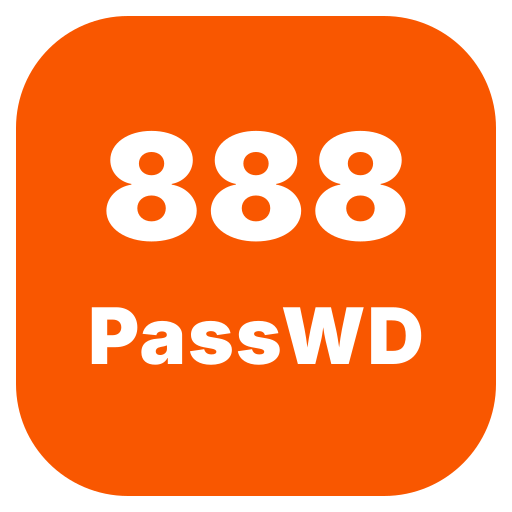

<p align="center">
  
</p>

<p align="center">
  運作於 Cloudflare Workers 上的 Bitwarden 相容伺服端
</p>

<p align="center">
  <a href="https://workers.cloudflare.com/"></a>
  <a href="./LICENSE"></a>
  <a href="https://github.com/tbdavid2019/nodewarden/releases/latest"></a>
</p>

<p align="center">
  <a href="./README.md">English</a> |
  <a href="./README_ZH.md">简体中文</a> |
  <a href="./CONTRIBUTING.md">貢獻指南</a> |
  <a href="https://nodewarden.app">官方 Wiki</a>
</p>

> **免責聲明**  
> 本專案僅供學習與技術交流使用，請務必定期備份您的密碼庫。  
> 本專案與 Bitwarden 官方無關，請勿向 Bitwarden 官方回報 NodeWarden 的相關問題。

---

## 與 Bitwarden 官方伺服器功能對比

| 功能 | Bitwarden 免費版 | NodeWarden | 說明 |
|---|---|---|---|
| 網頁密碼庫 | ✅ | ✅ | **原創 Web Vault 介面** |
| TOTP | ❌ | ✅ | 包含 `steam://` 支援 |
| **PWA / 離線使用** | ❌ | ✅ | **可安裝、支援離線使用與應用程式捷徑** |
| **Passkey 登入** | ✅ | ✅ | **支援 WebAuthn / FIDO2 無密碼登入** |
| API 金鑰 | ✅ | ✅ | 供 Bitwarden CLI 使用，支援產生與輪替 |
| 登入 2FA | ✅ | ✅ | 支援 TOTP、YubiKey、Passkey |
| 2FA 復原代碼 | ✅ | ✅ | 一次性復原代碼用於停用 2FA |
| 即時推播同步 | ✅ | ✅ | 網頁端、瀏覽器擴充功能、桌面端與行動端即時同步 |
| 附件 / Send | ✅ | ✅ | Cloudflare R2 或 KV |
| 匯入 / 匯出 | ✅ | ✅ | 支援 Bitwarden JSON / CSV / **ZIP 匯入（含附件）** |
| **雲端備份中心** | ❌ | ✅ | **支援 WebDAV / S3 排程增量備份** |
| 裝置管理 | ✅ | ✅ | **移除裝置、撤銷信任、永久信任** |
| 登入請求 | ✅ | ✅ | **跨裝置免密碼登入審核、跨裝置解鎖請求** |
| **多使用者支援** | ✅ | ✅ | 支援邀請碼註冊 |
| 網域規則 | ✅ | ✅ | 自訂等效網域、全域網域排除 |
| Fill-assist | ✅ | ✅ | `POST /fill-assist` 輔助用戶端自動填入；無法繞過密碼庫解鎖 |
| 組織 / 集合 / 成員權限 | ✅ | ❌ | 尚未實作 |
| SSO / SCIM / 企業目錄 | ✅ | ❌ | 尚未實作 |

---

## 已驗證用戶端

- ✅ Windows 桌面端
- ✅ 行動裝置 App (iOS / Android)
- ✅ 瀏覽器擴充功能 (Chrome, Edge, Firefox, Safari)
- ✅ Linux 桌面端
- ⚠️ macOS 桌面端尚未完整驗證

---

## 視覺化快速部署

1. Fork 本倉庫到自己的 GitHub 帳號
2. 進入 [Cloudflare Workers & Pages](https://dash.cloudflare.com/?to=/:account/workers-and-pages/create)
3. 選擇 **Continue with GitHub** 並選取您的倉庫
4. 建置命令填寫 `npm run build`，部署命令填寫 `npm run deploy`
   - 若欲使用 KV 模式，請將部署命令改為 `npm run deploy:kv`
5. 部署完成後，開啟產生的 Workers 網址

- Workers 預設網域名稱在部分網路環境可能無法直連。如需自訂網域，可至 [Workers 設定](https://dash.cloudflare.com/?to=/:account/workers/services/view/nodewarden/production/settings) 中新增。
- 若頁面提示缺少 `JWT_SECRET`，請至 Workers 設定中新增 Secret。正式環境請至少使用 32 個字元以上的強隨機字串。
- 若欲隱藏 Web Vault，可在 Workers 的「設定 → 變數與機密」中新增文字變數 `HIDE_WEB_VAULT`，值設為 `1`。啟用後，伺服器上的前端頁面與靜態資源統一回傳 `404 Not Found`，Bitwarden 用戶端所需的 API 仍可正常運作。

> [!TIP]
> 預設 R2 與可選 KV 的差異：
> | 儲存方式 | 是否需綁定信用卡 | 單一附件 / Send 檔案上限 | 免費額度 |
> |---|---|---|---|
> | R2 | 需要 | 100 MB（彈性上限可調整） | 10 GB |
> | KV | 不需要 | 25 MiB（Cloudflare 限制） | 1 GB |

---

## CLI 部署

```powershell
git clone https://github.com/tbdavid2019/nodewarden.git
cd nodewarden

npm install
npx wrangler login

# 預設：R2 模式
npm run deploy

# 可選：KV 模式
npm run deploy:kv

# 本地開發
npm run dev
npm run dev:kv
```

---

## 開源授權

LGPL-3.0 License

---

## 致謝

- [shuaiplus/NodeWarden](https://github.com/shuaiplus/NodeWarden) - 特別感謝原作者 [@shuaiplus](https://github.com/shuaiplus) 及其社群貢獻者所奠定的開源基礎與原始實作！
- [Bitwarden](https://bitwarden.com/) - 原始設計與官方用戶端
- [Vaultwarden](https://github.com/dani-garcia/vaultwarden) - 伺服端實作參考
- [Cloudflare Workers](https://workers.cloudflare.com/) - Serverless 執行平台
